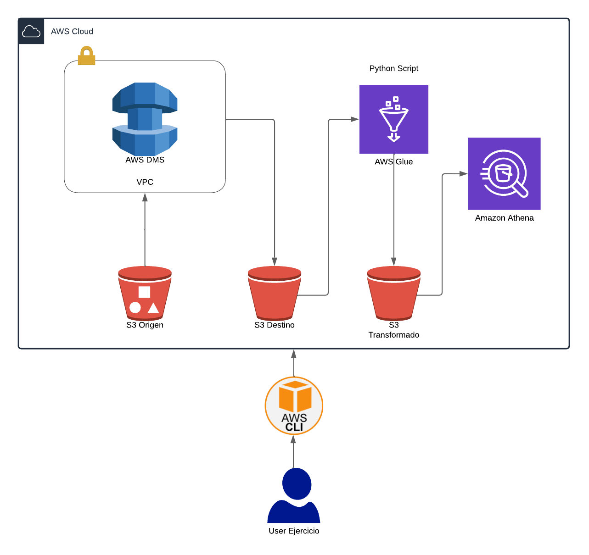

# Ejercicio IAC - SSR Level

Se disponibilizo un usuario IAM con acceso a los siguientes servicios en la plataforma de Amazon Web Services:
- S3
- Data Migration Service
- VPC
- Glue
- Athena
- Cloud Formation

## Requerimientos

Se requiere construir una arquitectura que satisfaga el siguiente diagrama

### **LIMPIAR DIAGRAMA**

- Se disponibilizo un set de datos no catalogados en esta carpeta de S3: *TODO ESCRIBIR PATH*
- Dichos datos deben ser migrados en la siguiente carpeta de S3: *TODO ESCRIBIR PATH*
- Los datos destino deben ser catalogados
- Se requiere saber las siguientes preguntas de negocio:
    - *TODO DEFINIR PREGUNTAS DE NEGOCIO*
- Alojar los datos que respondan a dichas preguntas de negocio en la siguiente carpeta de S3: *TODO ESCRIBIR PATH*
- Los datos transformados deben poder ser accesibles en formato tabla

## Notas
El template entregado debe ser en un formato valido de Cloud Formation (JSON o YAML)
